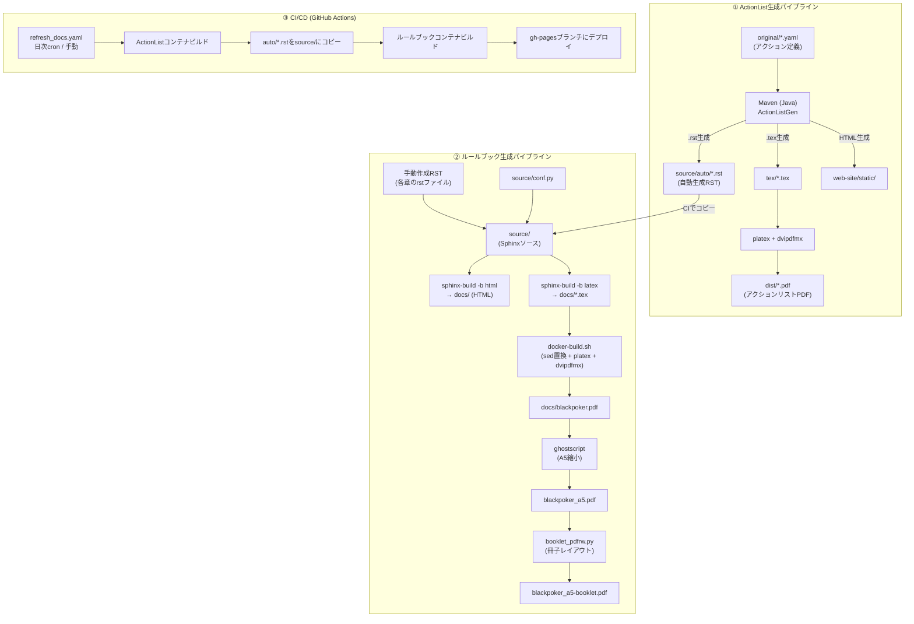
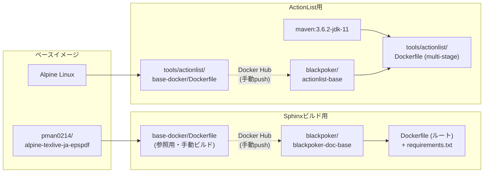
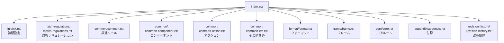
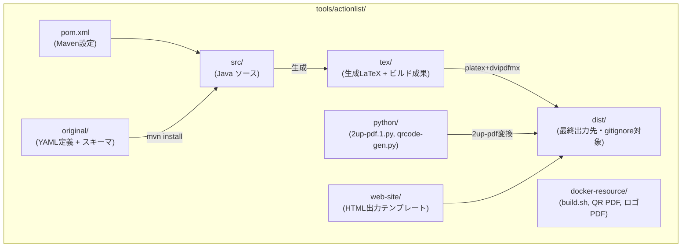

# ドキュメント構成とビルドフロー

BlackPokerプロジェクトのドキュメント生成フロー、ディレクトリ構成、Sphinxソース構造、ツール関係、および不要ファイルについてまとめています。

---

## 1. 全体アーキテクチャ（ビルドフロー）

プロジェクトには大きく分けて **2つの生成パイプライン** が存在し、CI上でそれらが連携して最終成果物を生成します。

1. **アクションリスト生成** (`tools/actionlist/`): YAML定義→Java(Maven)→LaTeX→PDF & RST
2. **ルールブック生成** (ルート `Dockerfile`): Sphinx (RST→HTML/LaTeX→PDF)

---

## 2. Dockerイメージの依存関係

---

## 3. Sphinxソース構成 (`source/`)

### toctree構成 (`index.rst`の章立て)

### ディレクトリ一覧

| ディレクトリ | ファイル数 | 役割 |
|---|---|---|
| `source/init/` | rst×1, puml×2 | 初期設定・ルール分類の説明 |
| `source/match-regulations/` | rst×1, csv×3 | 対戦レギュレーション・フレーム設定表 |
| `source/common/` | rst×4, puml×1, csv×1 | 共通ルール・コンポーネント・アクション |
| `source/common/images/` | 88ファイル | 図版・画像リソース |
| `source/format/` | rst×1 | フォーマットルール |
| `source/frame/` | rst×1 | フレームルール |
| `source/frame/images/` | 8ファイル | フレーム関連画像 |
| `source/core/` | rst×1, puml×6 | コアルール・PlantUMLフロー図 |
| `source/appendix/` | rst×1 + guideline/ | 付録（カスタムルール・二次創作ガイドライン） |
| `source/revision-history/` | rst×3 | 改版履歴(7th, 8th) |
| `source/auto/` | rst×3, csv×1 | **自動生成**（ActionListGenの出力、gitignore対象） |
| `source/_mysetting/` | py×1, dic×1, ist×1 | LaTeX索引辞書・冊子化スクリプト |
| `source/_static/` | svg×1, pdf×1, ico×1 | ロゴ・ファビコン |
| `source/_templates/` | html×1 | Sphinxテンプレートオーバーライド |

### Sphinx拡張・テーマ設定 (`conf.py`)

| 項目 | 値 |
|---|---|
| テーマ | `insipid` (insipid-sphinx-theme) |
| 拡張 | `sphinxcontrib.plantuml`, `sphinx.ext.mathjax`, `sphinx.ext.todo`, `sphinx.ext.githubpages` |
| 言語 | `ja` |
| LaTeX docclass | `jsbook` (A5) |
| PlantUML出力 | HTML: `svg_img` / LaTeX: `pdf` |

---

## 4. ツール構成 (`tools/actionlist/`)

### `original/` 内のYAML定義ファイル

| ファイル | 用途 | 備考 |
|---|---|---|
| `act.yaml` | アクション定義（現行版） | ビルドに使用 |
| `act-frame.yaml` | フレーム別アクション定義 | ビルドに使用 |
| `extra.yaml` | エクストラアクション定義 | ビルドに使用 |
| `frame.yaml` | フレーム定義 | ビルドに使用 |
| `merged.yaml` | 統合YAML | ビルドに使用 |
| `act.schema.json` | アクションYAMLスキーマ | バリデーション用 |
| `frame.schema.json` | フレームYAMLスキーマ | バリデーション用 |
| `v5-*.ods` | v5時代のODS（スプレッドシート） | **参照用の旧データ** |
| `v5-act_sample.yaml` | v5サンプルYAML | **旧バージョンの参照用** |
| `v5-extra.yaml` | v5エクストラYAML | **旧バージョンの参照用** |
| `v6-act.yaml` | v6アクションYAML | **旧バージョンの参照用** |
| `v6-extra.yaml` | v6エクストラYAML | **旧バージョンの参照用** |

---

## 5. ビルドコマンド整理

### ローカル開発用

| コマンド/スクリプト | 実行場所 | 役割 |
|---|---|---|
| `make livehtml` | ルート | Sphinx HTMLプレビュー（sphinx-autobuild） |
| `make buildhtml` | ルート | HTML静的ビルド（`build/_html`へ出力） |
| `make doc` | ルート | HTML出力を`docs/`に配置 |
| `make.bat livehtml` | ルート | Windows用のHTMLプレビュー |
| `local-build-pdf.sh` | ルート | ローカルPDFビルド（`docker-build.sh`を呼出） |
| `tools/actionlist/local_build.sh` | tools/actionlist | ActionList生成のローカル確認 |

### CI/CD

| ワークフロー | トリガー | 処理概要 |
|---|---|---|
| `refresh_docs.yaml` | 日次cron / 手動 | ①ActionListコンテナビルド→②auto/RST取込→③Sphinxビルド→④gh-pagesデプロイ |

---

## 6. 不要と思われるファイル・処理

### 6.1. 削除候補ファイル

| ファイル/ディレクトリ | 理由 |
|---|---|
| `source/common/memo.txt` | rstの下書き・概念整理メモ。ドキュメントソースに含まれておらず、index.rstから参照されていない。開発メモとして`dev-notes/`に移すか削除が適切 |
| `tools/actionlist/python/qrcode-gen.py` | QRコード生成スクリプト。ビルドパイプラインで使われていない（`build.sh`・`local_build.sh`から呼ばれない）。生成済みQR PDFは`docker-resource/`に配置済み |
| `tools/actionlist/original/v5-*.ods` (7ファイル) | v5時代のスプレッドシート。現在のビルドでは未使用（参照用の旧データ） |
| `tools/actionlist/original/v5-act_sample.yaml` | v5のサンプルYAML。現行ビルド未使用 |
| `tools/actionlist/original/v5-extra.yaml` | v5のエクストラYAML。現行ビルド未使用 |
| `tools/actionlist/original/v6-act.yaml` | v6アクションYAML。現行ビルドでは`act.yaml`が使用されている |
| `tools/actionlist/original/v6-extra.yaml` | v6エクストラYAML。現行ビルドでは`extra.yaml`が使用されている |
| `tools/actionlist/blackpoker-mast.rst` | ルートに直置きされたRSTファイル。ビルドフローで参照されていない |
| `tools/actionlist/log.log` | ビルドログ。`.gitignore`に`*.log`があるがtools以下にはルールが掛からない可能性あり |
| `redpen/` ディレクトリ全体 | RedPen（文章校正ツール）の設定。現在CI/ビルドフローで使われていない。ローカル校正用であれば`dev-notes/`等に統合可能 |
| `base-docker/` ディレクトリ | Sphinxビルド用ベースイメージ定義。CIでは`pman0214/alpine-texlive-ja-epspdf`を直接参照しており、このDockerfileは古い参照用の可能性が高い |

### 6.2. 不要と思われる処理・設定

| 対象 | 場所 | 理由 |
|---|---|---|
| `source/_templates/layout.html` のRTDテーマ用CSS/HTML | `source/_templates/layout.html` | テーマが`insipid`に変更済み。RTD（Read the Docs）テーマ用のスタイル・バージョンメニューのHTMLがコメントアウト状態で残っている |
| `conf.py`のRTDテーマ設定コメント | `source/conf.py` L76-77, L96-111 | `sphinx_rtd_theme` のコメントアウト設定が残存。`insipid`テーマ使用中のため不要 |
| `docker-build.sh`の囲み数字sed置換 | `docker-build.sh` L36-55 | TODOコメントに「全面的に囲み数字は廃止する予定」とあり。①〜⑳への16のsed置換処理が残存 |
| `refresh_docs.yaml`のコメントアウト処理 | `.github/workflows/refresh_docs.yaml` L53-64, L125-165 | GitHub Releaseへのアップロード・直接sphinx実行のコメントアウトされたステップ群 |
| `refresh_docs.yaml`の古いAPI使用 | `.github/workflows/refresh_docs.yaml` L30 | `::set-output`は非推奨（GitHub Actionsの新仕様では`$GITHUB_OUTPUT`を使用） |
| `refresh_docs.yaml`の古いバージョン | `.github/workflows/refresh_docs.yaml` | `actions/checkout@v2`は古い（現行は@v4）、python-version: 3.7も古い |
| `tools/actionlist/tex/` 内の中間ファイル | `tools/actionlist/tex/` | `.aux`、`.dvi`、`.log`ファイルが残存。`.gitignore`の対象(`tools/actionlist/tex/*.tex`等)ではあるが一部追跡されている可能性 |

### 6.3. `docs/` ディレクトリの大量ビルド成果物

`docs/` はビルド出力先であり`.gitignore`で`docs/*`が指定されていますが、**実際には大量のファイルがコミットされています**（Sphinx生成の`.sty`ファイル、`.xdy`ファイル、タロットカード画像、PlantUML生成PDF/EPS等）。GitHub Pagesデプロイ用であれば、gh-pagesブランチに分離し、masterの`docs/`はクリーンに保つことが推奨されます。

---

## 7. メンテナンスメモ

- **Dockerイメージの更新**: `base-docker/` と `tools/actionlist/base-docker/` はCIで自動更新されないため、環境更新時は手動でビルドし、Docker Hubへpushする必要があります
- **auto/ディレクトリ**: ActionListGenの出力先。`.gitignore`で管理され、CIビルド時にのみ生成されます（`.gitkeep`で空ディレクトリを保持）
- **conf.pyのバージョン管理**: `release`（発行日）と`version`（版数）は手動更新が必要。CIでは`github_version`のみsedで自動書き換えされます
