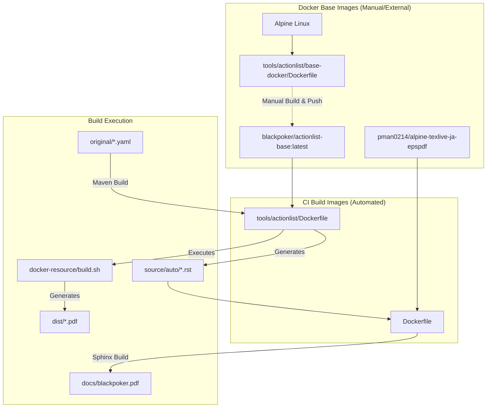

# ドキュメント構成とビルドフロー

BlackPokerプロジェクトのドキュメント生成フロー、ディレクトリ構成、およびビルドツールの実行経路についてまとめました。

## ドキュメント生成アーキテクチャ

プロジェクトには大きく分けて2つの生成フローが存在し、それぞれがDockerコンテナを利用しています。

1. **全体ルールブック (Sphinx)**: メインのドキュメント。GitHub Actions上で `Dockerfile` (ルート) を用いてビルド。
2. **アクションリスト (ActionListGen)**: 補助PDF資料。GitHub Actions上で `tools/actionlist/Dockerfile` を用いてビルド。

## ディレクトリ構成と役割

| ディレクトリ | 役割 | 備考 |
|---|---|---|
| `source/` | Sphinxドキュメントのソースルート | |
| `tools/actionlist/` | アクションリスト生成ツールのプロジェクトルート | (Java/Maven) |
| `tools/actionlist/base-docker/` | `blackpoker/actionlist-base` 生成用定義 | **CI自動ビルド対象外**。手動更新が必要。 |
| `base-docker/` | Sphinxビルド用ベースイメージ定義 | 参照用。CIでは不使用。 |
| `tools/actionlist/docker-resource/` | コンテナ内ビルド用スクリプト | `build.sh` は `ActionList` コンテナ内で使用。 |

## ビルドツールの実行経路

各ビルドコマンドの役割と実行タイミングは以下の通りです。

### 1. ローカル開発・確認用

| コマンド/スクリプト | 実行場所 | 役割・詳細 |
|---|---|---|
| `make livehtml` | ルート | **Sphinx HTMLプレビュー** ローカルでWebサーバーを立ち上げ、`source` の変更をリアルタイムにブラウザで確認できます。 (`make.bat` -> `sphinx-autobuild` を使用) |
| `local-build-pdf.sh` | ルート | **ローカルPDFビルド** `docker-build.sh` を呼び出し、PDF出力を確認するためのスクリプトです。 手元で素早くPDFのレイアウト崩れなどを確認したい場合に使用します。 |
| `tools/actionlist/local_build.sh` | `tools/actionlist` | **ActionList生成確認** アクションリストのPDFおよびHTML出力をローカルで生成・確認します。 Javaのツール (`ActionListGen`) を実行し、`dist/` 配下に成果物を出力します。 |

### 2. CI/CD (GitHub Actions)

| ワークフローファイル | トリガー | 役割・詳細 |
|---|---|---|
| `.github/workflows/refresh_docs.yaml` | 日次 (cron) 手動 (workflow_dispatch) | **ドキュメントの全ビルド・デプロイ** 毎日（または手動実行時）に以下の処理を一括で行います。 1. Dockerコンテナでアクションリストをビルド (`tools/actionlist`) 2. 生成された `source/auto` を取り込み、Sphinxで全体ドキュメントをビルド 3. 生成されたHTML/PDFを GitHub Pages (`gh-pages` ブランチ) にデプロイ |

## メンテナンスメモ

- **Dockerイメージの更新**: `tools/actionlist/base-docker/` はCIで自動更新されないため、環境更新時は手動でビルドし、Docker Hub (`blackpoker/actionlist-base`) へプッシュする必要があります。
- **不要ファイルの削除**: 2026/02の整理により、未使用の `tools/actionlist/python/*.py` スクリプト等は削除されました。
