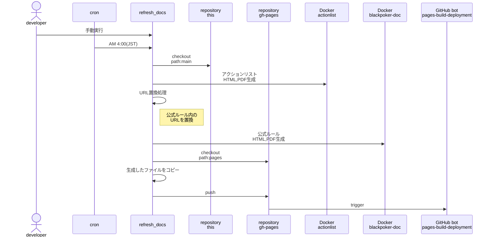

# GitHub環境設定
次のように設定ししています。

<!-- @import "[TOC]" {cmd="toc" depthFrom=1 depthTo=6 orderedList=false} -->

<!-- code_chunk_output -->

- [GitHub環境設定](#github環境設定)
- [GitHubAction](#githubaction)
  - [refresh_docs](#refresh_docs)
    - [処理の流れ](#処理の流れ)
- [リリース手順](#リリース手順)
  - [新版作成時](#新版作成時)
  - [リリース時](#リリース時)

<!-- /code_chunk_output -->

# GitHubAction

## refresh_docs

ブランチ単位にドキュメントを生成し、github-pagesに反映します。
実行契機は以下があります。

  * 手動実行
    * ブランチを指定して実行できます。
  * 自動実行
    * 毎日masterブランチを対象に実行します。

### 処理の流れ

# リリース手順

リリースする際は、次の手順を行います。

## 新版作成時

新しい版数を制定する際は、次の手順を追加で行います。

1. 変更箇所のページを作成
    * wikiに「7th edition changes」など変更箇所をまとめたページを作成
1. README.mdに新版のリンクを追加
    * 変更箇所をまとめたページへのリンクを追加
1. ブランチ作成
    * 6thや7thなど新版のブランチを作成
    * release-task.mdの6thなどを新版に更新

## リリース時

リリース作業は、次のissueを発行して行います。

[Release-issue作成リンク](https://github.com/BlackPoker/BlackPoker/issues/new?assignees=BlackPoker&labels=task&projects=&template=release-task.md&title=%5BReleaseTask%5D+)

issue内に必要な作業は記載されています。