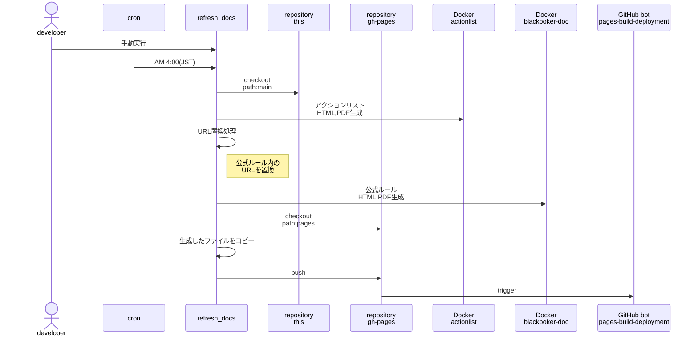

# GitHub環境設定
次のように設定ししています。

<!-- @import "[TOC]" {cmd="toc" depthFrom=1 depthTo=6 orderedList=false} -->

<!-- code_chunk_output -->

- [GitHub環境設定](#github環境設定)
- [GitHubAction](#githubaction)
  - [refresh_docs](#refresh_docs)
    - [処理の流れ](#処理の流れ)
- [リリース手順](#リリース手順)
  - [新版作成時](#新版作成時)
  - [リリース時](#リリース時)

<!-- /code_chunk_output -->

# GitHubAction

## refresh_docs

ブランチ単位にドキュメントを生成し、github-pagesに反映します。
実行契機は以下があります。

  * 手動実行
    * ブランチを指定して実行できます。
  * 自動実行
    * 毎日masterブランチを対象に実行します。

### 処理の流れ

```mermaid
sequenceDiagram
  actor line_7 as developer
  participant line_6 as cron
  participant line_1 as refresh_docs
  participant line_2 as repository<br>this
  participant line_5 as repository<br>gh-pages
  participant line_3 as Docker<br>actionlist
  participant line_4 as Docker<br>blackpoker-doc
  participant line_8 as GitHub bot<br>pages-build-deployment
  line_7 ->> line_1: 手動実行
  line_6 ->> line_1: AM 4:00(JST)
  line_1 ->> line_2: checkout<br>path:main
  line_1 ->> line_3: アクションリスト<br>HTML,PDF生成
  line_1 ->> line_1: URL置換処理
  Note right of line_1: 公式ルール内の<br>URLを置換
  line_1 ->> line_4: 公式ルール<br>HTML,PDF生成
  line_1 ->> line_5: checkout<br>path:pages
  line_1 ->> line_1: 生成したファイルをコピー
  line_1 ->> line_5: push
  line_5 ->> line_8: trigger
```

# リリース手順

リリース作業には、新しいブランチ（例：`9th`）を**新規作成する場合（パターンA）**と、すでに存在するブランチに**マージする場合（パターンB）**の2つのパターンがあります。それぞれGitHub上での操作手順が異なります。

## パターンA：新規の版数（例: 9.0版）を作成し、新しいブランチを作る場合
もともと `9th` のようなリリース用ブランチが存在しない場合の操作手順です。

1. **変更履歴RSTファイルの作成**
    * `source/revision-history/` 配下に新しく `9.2th.rst` などの変更履歴RSTファイルを作成し、変更箇所をまとめます（前バージョンのファイルをコピーして流用すると便利です）。
2. **変更履歴一覧（toctree）への追加**
    * `source/revision-history/revision-history.rst` の `toctree` ディレクティブの先頭に、新しく作成したファイル名（例: `9.2th`）を追記してリストに登録します。
3. **GitHub上での新ブランチ作成**
    * GitHubのリポジトリトップページ（ [BlackPoker/BlackPoker](https://github.com/BlackPoker/BlackPoker) ）にアクセスします。
    * 左上にあるブランチ選択ドロップダウン（通常は `master` が選択されています）をクリックします。
    * 入力欄に新しいブランチ名（例: `9th`）を入力します。
    * ドロップダウンの下部に表示される **「Create branch: 9th from 'master'」** をクリックします。これで `master` の最新状態を引き継いだ `9th` ブランチが作成されます。
4. **Issueテンプレートの更新**
    * 新しいリリース用ブランチに合わせて、`.github/ISSUE_TEMPLATE/release-task.md` 内に記載されている `Xth` などのブランチ名の記述箇所を新しいブランチ名に書き換えて `master` にコミットします。

---

## パターンB：既存の版数（例: 9.1版）をリリースし、既存ブランチに反映する場合
すでに `9th` のようなリリース用ブランチが存在し、`master` に加えた複数の修正をそのブランチに反映（マージ）する場合の操作手順です。

1. **バージョン情報の更新 (version.json)**
    * `tools/actionlist/original/version.json` を開き、以下の内容を編集して `master` ブランチにコミットします。
      * `ver`: 新しいバージョン名（例: `第9.1.0版`）
      * `lastupdate`: リリース日（例: `2026/07/02`）
      * ※これにより、ビルドされるHTML/PDFドキュメントやアクションリスト内のバージョン情報が自動的に一括更新されます。
2. **GitHubでPull Request（PR）を作成する**
    * GitHubの [Pull Requests タブ](https://github.com/BlackPoker/BlackPoker/pulls) を開きます。
    * 右上の **「New pull request」** ボタンをクリックします。
    * 比較対象となるブランチを選択します：
        * 左側の **base:** に、反映先となるリリースブランチ（例: `9th`）を選択します。
        * 右側の **compare:** に、反映元となる `master` を選択します。
    * **「Create pull request」** ボタンをクリックします。
    * タイトル（例: `Release 9.1`）を入力し、再度 **「Create pull request」** をクリックしてPRを起票します。
3. **PRをマージする**
    * 自動ビルド・テストがパスしたことを確認します。
    * PRページの下部にある **「Merge pull request」** をクリックし、**「Confirm merge」** をクリックしてマージを完了します。

### 💡 注意：マージ後の「recent pushes」表示について
PRをマージした直後、GitHubのトップページ等に **「`Xth had recent pushes XX minutes ago`」** という黄色いバナーが表示されることがあります。

* **原因**: GitHubが「更新されたブランチ（`Xth`）からデフォルトブランチへの逆向きのPull Requestを作りませんか？」と自動でリコメンドしている表示です。
* **対応**: 今回のリリース作業では、`master` から `Xth` への反映が目的であり、逆向きのPRは不要です。したがって、この表示は**完全に無視（スルー）**して問題ありません。（「Compare & pull request」ボタンは押さずに無視してください）

---

## GitHubでのリリース（タグ）作成手順
マージ完了後、または新ブランチ作成後に正式なリリースバージョン（例：`v9.0.1` などのタグ）を発行する手順です。

1. **Releases ページを開く**
    * GitHubの [Releases ページ](https://github.com/BlackPoker/BlackPoker/releases) を開きます。
2. **ドラフトの作成開始**
    * 右上にある **「Draft a new release」** ボタンをクリックします。
3. **リリースの設定入力**
    * **Choose a tag**: 新しいバージョンタグを入力します（例: `v9.0.1` や `v9.1.0`）。入力後、直下に表示される **「Create new tag: vX.Y.Z on publish」** をクリックします。
    * **Target**: リリース対象のブランチを選択します。
      * デフォルトは `master` になっていますが、必ず**リリース用ブランチ（例: `9th` などの対象ブランチ）**に変更してください。
    * **Release title**: リリース名を入力します。通常はタグ名と同じ `vX.Y.Z` で問題ありません。
    * **Description**: リリース内容の説明を記載します（例: 変更内容や対応したIssueへのリンクなど）。
4. **リリースの発行**
    * ページ最下部にある緑色の **「Publish release」** ボタンをクリックします。これでタグが作成され、リリースが公開されます。

---

## リリース用Issueの起票
実際のリリース作業は、以下のリンクからIssueを発行し、そのチェックリストに沿って進めます。手順の全体像はIssue内にすべて記載されています。

[Release-issue作成リンク](https://github.com/BlackPoker/BlackPoker/issues/new?assignees=BlackPoker&labels=task&projects=&template=release-task.md&title=%5BReleaseTask%5D+)