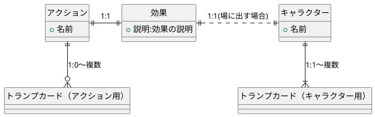

# BlackPokerの原理

BlackPokerがどのようにトレーディングカードゲーム（TCG）として遊べるのか、その仕組みを説明します。

## トランプの枚数は有限。TCGの種類は無限

一般的なトランプは54枚で構成されていますが、TCGのカードの種類は無限に増やすことができます。正確には、TCGのカードの種類はカードの名前の数に依存します。同じカード名があるとゲームに支障が出るため、名前が異なる限り、無限にカードを作成できます。トランプでTCGのように遊ぶには、この種類の限界を突破する必要があります。

次に、一般的なTCGにおける魔法カードとキャラクター召喚カードについて考えてみましょう。

### 従来のTCGの仕組み

従来のTCGでは、カードとその効果は一対一で紐づけられています。例えば、「対戦相手にダメージを与える」魔法カードの場合、カードと効果の関係は次のようになります。


また、キャラクターを召喚するカードも同様に、そのカードは「キャラクターを場に出す」という効果とキャラクター自身を1枚で表しています。


このように、従来のTCGではカードと効果は固定されており、効果は次のように定義されます。

```
効果とは、ある状態から別の状態に変化させること
```

### BlackPokerの仕組み

BlackPokerでは、効果とカードを分離しています。効果はアクションの属性として扱い、アクションを起こすためのキーカードをアクションごとに定義します。



アクションが従来のカードゲームのカードに相当します。これにより、54枚のトランプから無限のアクションを作ることができます。ただし、人が覚えられるアクションの数には限界があるため、定義されるアクションの数は数十個にとどまります。

### BlackPokerの利点

BlackPokerでは、各カードに固定された効果がないため、限られたトランプの枚数で多様なアクションを実現できます。これにより、プレイヤーは自由にゲームの戦略を組み立てることができ、ゲームの多様性が大幅に広がります。


