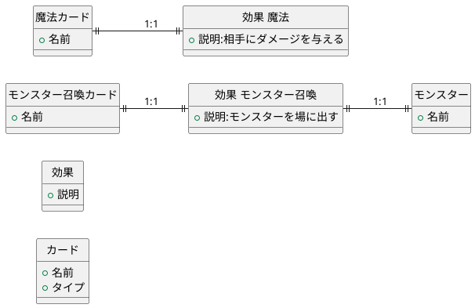
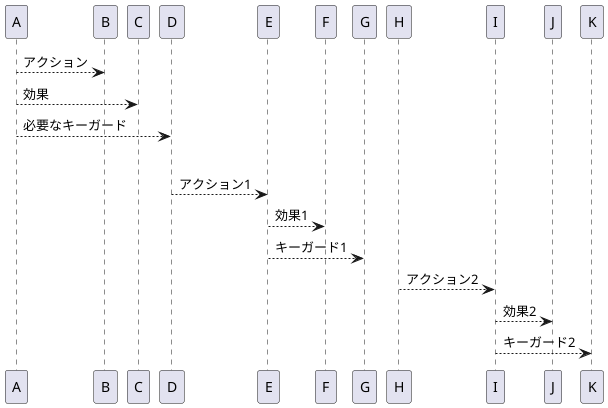

# BlackPokerの原理

BlackPokerがどのようにトレーディングカードのように遊べるのか、その原理を説明します。

トレーディングカードはTCGと略して記載します。

## トランプの枚数は有限。TCGの種類は無限

一般的なトランプは54枚で構成されています。
一方TCGのカードの種類は、日々種類を増やしており、無限に作ることができます。

無限では正確ではないので、もう少し深堀りしましょう。
TCGのカードの種類はカードの名前の数に依存します。
同じカード名がある場合、ゲームに支障が出るため。
カードの名前の数が考えられれば、無限にカードを作ることができます。

トランプでTCGのように遊ぶには、種類の限界を突破する必要があります。

ここで一般的なTCGにあるモンスターの召喚カードと魔法カードについて考えて見ましょう。

効果とは、ある状態からある状態に変化させることと定義できます。

### 従来のトレーディングカードゲーム（TCG）の原理

従来のTCGでは、カードと効果が一対一で紐づいています。

例えば、モンスターを召喚するカードがあったとします。これはモンスターを場に出す効果とモンスター自身を1枚のカードで表しています。魔法などの呪文カードも1枚のカードで1つの効果を表しています。

### BlackPokerの原理

BlackPokerでは、効果とカードを分離しています。効果をアクションの持つ属性とし、そのアクションを起こすために必要なキーガードをアクションごとに定義しています。

どのようなアクションがあるのかは遊び方によって異なります。アクションが従来のカードゲームのカードに相当する物になります。こうすることで54枚という限られたトランプから無限のアクションを起こすことができるようになります。しかし、人が覚えることができるものには限界があるので、定義されているアクションの数は数十個です。

### BlackPokerの利点

BlackPokerでは、従来のトレーディングカードゲームのように各カードに一つの効果が固定されていないため、トランプの限られた枚数で多様なアクションを実現できます。これは、プレイヤーがゲームの戦略を自由に組み立てることを可能にし、ゲームの多様性を大きく広げることができます。