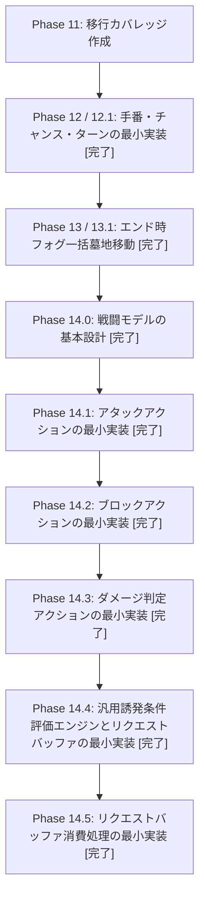

# 新ルールYAML DSL 移行カバレッジ表 (vNext Coverage)

本ドキュメントは、新ルールYAML DSLおよびプロトタイプシミュレーター（`tools/simulator`）における、BlackPoker 第9.0版公式ルールの実装状況とカバレッジを示す管理表です。

---

## 1. 総合カバレッジ要約

- **YAML DSLスキーマの表現力**: **約 85%** (基本的なコスト、複数キーカード、誘発条件、アビリティ定義をサポート)
- **実行エンジン機能 (Command Registry)**: **約 85%** (主要なカード効果、戦闘解決、リクエストバッファ蓄積、移送処理をサポート)
- **ルール完全再現カバレッジ**: **約 75%** (ターン・チャンス・戦闘コア・汎用誘発エンジン・移送エンジンの最小実装が完了)

---

## 2. 詳細カバレッジ表

### 2.1. カード・コンポーネント定義 (official-base.yaml)

| コンポーネント ID | 定義状況 | テスト状況 | 備考 |
| :--- | :---: | :---: | :--- |
| `character.soldier` (一般兵) | **定義済み** | **パス** | 攻撃・防御ラベルを所持する基本キャラクター |
| `character.bulwark` (防壁) | **定義済み** | **パス** | ♡A〜K, ♢A〜K をカード条件とする防御用キャラクター |
| `fog.up` (アップフォグ) | **定義済み** | **パス** | サイズを +key.rankValue する補正フォグ |
| `fog.down` (ダウンフォグ) | **定義済み** | **パス** | サイズを -key.rankValue する補正フォグ |
| `trump.fortress` (要塞) | **定義済み** | **パス** | ♣9 を表切札とする常在能力防衛トランプ |

### 2.2. アクション定義 (examples/)

| アクション ID | 定義状況 | テスト状況 | サマリー期待値との一致 | 備考 |
| :--- | :---: | :---: | :---: | :--- |
| `action.up` (アップ) | **定義済み** | **パス** | 一致 (OK) | クイックタイミングでのサイズ増幅効果 |
| `action.down` (ダウン) | **定義済み** | **パス** | 一致 (OK) | メインタイミングでのサイズ減衰効果 (0以下墓地送り) |
| `action.summonSoldier` (兵士召喚) | **定義済み** | **パス** | 一致 (OK) | 手札のカードを一般兵として召喚 |
| `action.destroyBulwark` (防壁破壊) | **定義済み** | **パス** | 一致 (OK) | 複数キーカード (♡+♢) による防壁の即時破壊 |
| `action.throwing` (投擲) | **定義済み** | **パス** | 一致 (OK) | 複数キーカード (♠+♣) による対戦相手へのダメージ |
| `action.counter` (カウンター) | **定義済み** | **パス** | 一致 (OK) | クイックタイミングでの他リクエストのキャンセル |
| `action.twist` (ツイスト) | **定義済み** | **パス** | 一致 (OK) | ユニット状態のチャージ/ドライブ状態のトグル |
| `action.attack` (アタック) | **定義済み** | **パス** | 一致 (OK) | メインタイミングでの戦闘開始宣言とアタッカーバインド |
| `action.block` (ブロック) | **定義済み** | **パス** | 一致 (OK) | ブロックタイミングでのアタッカーに対するブロッカーバインド |
| `action.damageJudge` (ダメージ判定) | **定義済み** | **パス** | 一致 (OK) | ダメージ判定タイミングでのサイズ比較・敗北墓地送り |
| `action.nextGeneration` (世代交代) | **定義済み** | **パス** | 一致 (OK) | 領域移動 (field->grave) を契機とするライフめくり誘発 |

### 2.3. ゲームシステム・実行エンジン (Command Registry)

| 機能エリア | 実装状況 | テスト | CLI確認 | 備考 |
| :--- | :---: | :---: | :---: | :--- |
| **手番・チャンス管理 (Turn & Chance)** | **最小実装済み** | **可** | **可** | `TurnManager` による main / quick タイミング制約の検証 |
| **LIFOステージ解決 (LIFO Stage)** | **最小実装済み** | **可** | **可** | リクエスト事前検証、コスト2重チェック、LIFOスタック解決 |
| **効果解釈 (Effect Interpreter)** | **最小実装済み** | **可** | **可** | コマンドのシーケンス実行、`if-then-else` 分岐、予測評価 |
| **常在能力評価 (Ability Evaluator)** | **最小実装済み** | **可** | **可** | フォグのサイズ累積計算、要塞による汎用ダメージ無効化アビリティ |
| **事前検証 (Request Validator)** | **最小実装済み** | **可** | **可** | 複数キーカードの全順列探索一致チェック、triggered属性時のタイミング・対象チェックバイパス |
| **戦闘解決 (Combat Resolution)** | **最小実装済み** | **可** | **可** | アタッカー・ブロッカー対応関係のバインド、サイズ比較・生存・墓地送り、ブロッカー不在時の直接ダメージ |
| **汎用誘発条件評価 (Trigger Resolver)** | **最小実装済み** | **可** | **可** | YAMLの誘発条件評価、公式「リクエストバッファ (`state.requestBuffer`)」への蓄積、definitionOwnerとcontrollerの分離（p1/p2） |
| **バッファ移送処理 (Request Buffer Processor)** | **最小実装済み** | **可** | **可** | リクエストバッファからステージへの安全な移送、ID発行、historyへのmovedToStageの記録 |

---

## 3. 完全再現までの大きな残り領域

カバレッジ向上の観点から、新YAML DSLシミュレーターを BlackPoker 第9.0版公式ルールに完全に適合させるための大きな残り領域は以下の通りです。

### ① プレイヤー別 actionList / componentList の分離
- **現状**: 現在は共通の `actions` 定義リストを参照していますが、TCGではカード効果などによるアクションやコンポーネントの参照可能リストの変化は本来プレイヤー側に閉じるべきです。
- **今後の展望**: 各プレイヤーが個別にアクション/コンポーネント定義リストを保持するモデル（`state.players[p1].actionList` / `state.players[p1].componentList` 等）へ分離します。

### ② 対象選択（ブロック宣言時ブロッカー指定）の整理
- **現状**: `action.block` は本来、リクエスト（ステージ移行）時点では対象を必要とせず、効果解決時（`declareBlock` コマンド実行時）に選択されます。
- **今後の展望**: 既存 `block.yaml` に `targetUnit` の targets 定義が残っている点や、`declareBlock` が現在 `targetUnit` 前提になっている部分について、将来的に「効果解決時選択（selection / choiceProvider / context.selection）」へ移行・整理します。

### ③ リクエストバッファの完全自動解決統合
- **現状**: 現在はバッファからステージへ手動・明示的に移送（`moveNextBufferedRequestToStage`）していますが、最終的にはコアフロー側で自動的にバッファを消費・自動解決するフローを完成させる必要があります。

### ④ 戦闘割り込み時のアタッカー状態変化の裁定
- **現状**: アタック宣言後、ダメージ判定解決までの間にアタッカーがツイスト等でチャージ状態に戻された場合の戦闘挙動のルール定義が未実装です。

---

## 4. フェーズロードマップの実績

これまでの検証結果およびロードマップの進捗状況です。

本フェーズ（Phase 14.5）をもって、アタック・ブロック・ダメージ判定のフル戦闘解決フロー、およびそれを統一的に評価してステージに移送する「汎用誘発評価エンジン・リクエストバッファ消費処理」の最小検証がすべて 100% 成功のうえ完了しました。
