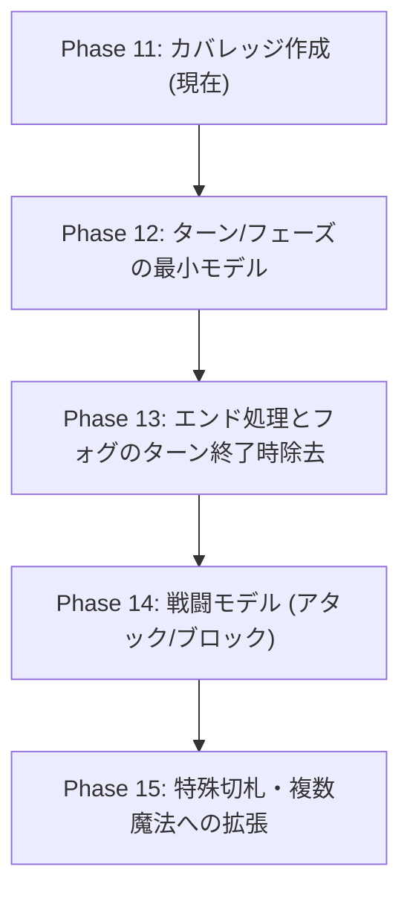

# 新ルールYAML DSL シミュレーター カバレッジ表およびロードマップ (第9.0版再現に向けて)

本ドキュメントは、Phase 1〜10.2で構築した新ルールYAML DSLシミュレーター（`tools/simulator`）が、BlackPoker 第9.0版の公式ルール定義（`act.yaml` / `act-frame.yaml`）および公式ルール本文（システムロジック）をどの程度再現できているかを網羅的に整理・評価したカバレッジ資料です。

これにより、現在の移行検証ステータスを可視化し、第9.0版再現に向けた今後の実装優先順位およびロードマップを明確にします。

---

## 1. 実装状態の評価基準 (6段階)

カバレッジ表における各要素の実装状態は、以下の6段階のステータスで厳密に分類・評価しています。

- **完了 (Complete)**: 仕様を完全に満たし、新YAML DSL、テスト、CLIフックが100%実装・動作している状態。
- **最小実装済み (Minimal)**: 基本的な効果や機能（例: カウンターやツイスト）について、検証用の最小限のモデルが実装・テストで動作している状態。
- **部分実装 (Partial)**: 要素の定義や一部のアビリティ（例: 要塞のダメージ無効化）のみが実装され、一部の仕様が未対応の状態。
- **未実装 (Not Implemented)**: DSL定義、エンジン解釈ともに未対応の状態。
- **調査中 (Under Investigation)**: 新規アビリティの設計やエンジンに与える影響範囲、仕様の整合性を精査している状態。
- **旧定義なし (rules-vnext独自)**: 旧システム（第9.0版）には静的な定義がなく、新シミュレーターエンジンの実行や状態移行のために独自に設計・追加したコマンドや仕組み。

---

## 2. カバレッジ表

### 2.1. 基本アクション (Basic Actions)

| 旧ID | 旧名称 | 新YAML ID | 情報源 | 実装状態 | 比較状態 | テスト | CLI | 未実装理由 / 補足 | 優先度 |
| :--- | :--- | :--- | :--- | :---: | :---: | :---: | :---: | :--- | :---: |
| `end` | エンド | `action.end` | `act.yaml` | 未実装 | - | なし | なし | ターン/フェーズ遷移システムが未実装のため | **高** |
| `charge` | チャージ | `action.charge` | `act.yaml` | 未実装 | - | なし | なし | チャージアクションの解釈・効果および状態トグルの統合が未対応のため | **高** |
| `draw` | ドロー | `action.draw` | `act.yaml` | 未実装 | - | なし | なし | ターン開始時のドローフェーズ移行およびデッキ・手札間移動ロジックが未実装のため | **高** |
| `attack` | アタック | `action.attack` | `act.yaml` | 未実装 | - | なし | なし | 戦闘フェーズ、アタック対象の選択宣言および攻撃側・防御側の対話型解決が未実装のため | **高** |
| `block` | ブロック | `action.block` | `act.yaml` | 未実装 | - | なし | なし | 戦闘フェーズ、ブロック宣言および戦闘ダメージの割り当て・ターゲット解決が未実装のため | **高** |
| `damageJudge` | ダメージ判定 | `action.damageJudge` | `act.yaml` | 未実装 | - | なし | なし | 戦闘ダメージ適用時のサイズ比較および墓地送り・ダメージ累積の戦闘処理エンジンが未対応のため | **高** |
| `nextGeneration` | 世代交代 | `action.nextGeneration` | `act.yaml` | 完了 | OK | あり | あり | 場のLegacy Card墓地移動に伴う誘発・ライフめくり処理を実装完了 | - |

### 2.2. 召喚アクション (Summon Actions)

| 旧ID | 旧名称 | 新YAML ID | 情報源 | 実装状態 | 比較状態 | テスト | CLI | 未実装理由 / 補足 | 優先度 |
| :--- | :--- | :--- | :--- | :---: | :---: | :---: | :---: | :--- | :---: |
| `setBulwark` | 防壁設置 | `action.setBulwark` | `act.yaml` | 完了 | OK | あり | あり | 手札から裏向き防壁（チャージ）を伏せる召喚処理を実装完了 | - |
| `summonsSoldier` | 兵士召喚 | `action.summonSoldier` | `act.yaml` | 完了 | OK | あり | あり | 手札から一般兵を表向き（チャージ）で出す召喚処理を実装完了 | - |
| `summonsHero` | 英雄召喚 | `action.summonsHero` | `act.yaml` | 未実装 | - | なし | なし | 英雄キャラクター固有のアビリティ評価・フィールド展開が未対応のため | **中** |
| `summonsAce` | エース召喚 | `action.summonsAce` | `act.yaml` | 未実装 | - | なし | なし | エースキャラクター定義および召喚条件の検証ロジックが未対応のため | **中** |
| `quickSummonsAce` | クイック召喚 | `action.quickSummonsAce` | `act.yaml` | 未実装 | - | なし | なし | エース召喚におけるタイミング条件（クイック）と召喚時の割り込み処理が未対応のため | **中** |
| `summonsMagic` | 魔術士召喚 | `action.summonsMagic` | `act.yaml` | 未実装 | - | なし | なし | 魔術士キャラクターの固有能力・召喚ロジックが未対応のため | **中** |
| `mountSoldier` | 装備 | `action.mountSoldier` | `act.yaml` | 未実装 | - | なし | なし | ユニットに対するカード・装備アタッチメント構造およびバフ・効果付与システムが未実装のため | **中** |

### 2.3. 魔法アクション (Magic Actions)

| 旧ID | 旧名称 | 新YAML ID | 情報源 | 実装状態 | 比較状態 | テスト | CLI | 未実装理由 / 補足 | 優先度 |
| :--- | :--- | :--- | :--- | :---: | :---: | :---: | :---: | :--- | :---: |
| `up` | アップ | `action.up` | `act.yaml` | 完了 | OK | あり | あり | フォグ生成（バインド）によるサイズ動的加算処理を実装完了 | - |
| `down` | ダウン | `action.down` | `act.yaml` | 完了 | OK | あり | あり | 予測条件式（size - rank <= 0）を伴うサイズ減衰・墓地送り処理を実装完了 | - |
| `twist` | ツイスト | `action.twist` | `act.yaml` | 最小実装済み | OK | あり | あり | `toggleUnitState` コマンドによりキャラクター1体の状態をトグルする最小モデル。将来的な `chooseState` / `setUnitState` への拡張が必要 | **中** |
| `counter` | カウンター | `action.counter` | `act.yaml` | 最小実装済み | OK | あり | あり | `cancelRequest` コマンドによりLIFOステージ上の pending リクエストを無効にする最小モデル。キーカード数・数字比較条件等の完全実装が必要 | **中** |
| `destroyBulwark` | 防壁破壊 | `action.destroyBulwark` | `act.yaml` | 完了 | OK | あり | あり | 対象防壁の墓地送り処理および「世代交代」連鎖誘発を実装完了 | - |
| `throwing` | 投擲 | `action.throwing` | `act.yaml` | 完了 | OK | あり | あり | スート数値解決（keyCards.spade.rankValue）およびプレイヤーダメージ・「要塞」による無効化を実装完了 | - |
| `deathLance` | 死の槍 | `action.deathLance` | `act.yaml` | 未実装 | - | なし | なし | 単体・複数キャラクターの直接破壊および墓地送り解決が未対応のため | **中** |
| `addBulwark` | 防壁補充 | `action.addBulwark` | `act.yaml` | 未実装 | - | なし | なし | ライフから防壁領域へ直接カードを補充するリソース操作コマンドが未対応のため | **中** |
| `reanimate` | リアニメイト | `action.reanimate` | `act.yaml` | 未実装 | - | なし | なし | 墓地から指定キャラクターを選択してフィールドに再召喚するコマンドが未対応のため | **中** |
| `handeth` | ハンデス | `action.handeth` | `act.yaml` | 未実装 | - | なし | なし | 相手の手札をランダムまたは選択して墓地へ送るコマンドおよび検証が未対応のため | **中** |
| `kill` | キル | `action.kill` | `act.yaml` | 未実装 | - | なし | なし | クイックタイミングでのキャラクター即死判定および条件評価が未対応のため | **中** |
| `reunion` | 再会 | `action.reunion` | `act.yaml` | 未実装 | - | なし | なし | 墓地から手札にカードを回収するリターンコマンドが未対応のため | **低** |
| `truce` | 停戦 | `action.truce` | `act.yaml` | 未実装 | - | なし | なし | ターン強制終了やフェーズ移行のスキップ制御が未対応のため | **低** |
| `changeTarget` | 対象変更 | `action.changeTarget` | `act.yaml` | 未実装 | - | なし | なし | ステージ上に積まれている他の pending リクエストのターゲット（`targetComponent` 等）を書き換える対象操作コマンドが未実装のため | **中** |
| `search` | サーチ | `action.search` | `act.yaml` | 未実装 | - | なし | なし | 山札（デッキ）から特定のカードを探索し、手札に追加またはシャッフルする処理が未対応のため | **中** |
| `reverse` | リバース | `action.reverse` | `act.yaml` | 未実装 | - | なし | なし | 場の防壁の表裏表示（face: up / down）をトグルするコマンドが未実装のため | **低** |
| `unsummons` | 帰還 | `action.unsummons` | `act.yaml` | 未実装 | - | なし | なし | 場のキャラクターを手札（バウンス）に戻すリソース操作コマンドが未対応のため | **中** |
| `swordRain` | 剣の雨 | `action.swordRain` | `act.yaml` | 未実装 | - | なし | なし | フィールドの全ユニットまたは対象範囲の全ユニットに対する一括ダメージ解決が未実装のため | **低** |
| `force` | フォース | `action.force` | `act.yaml` | 未実装 | - | なし | なし | 相手の場に強制的にユニットを配置またはチャージ状態の操作が未実装のため | **低** |
| `recruit` | 徴募 | `action.recruit` | `act.yaml` | 未実装 | - | なし | なし | 山札（デッキ）の上からめくってユニットを召喚する等のランダム召喚が未対応のため | **低** |
| `surprise` | 奇襲 | `action.surprise` | `act.yaml` | 未実装 | - | なし | なし | 奇襲召喚時のタイミング制約・バフ評価が未実装のため | **低** |
| `bj` | B・J | `action.bj` | `act.yaml` | 未実装 | - | なし | なし | 手札枚数や数字の合計判定に基づく特殊解決・ドロー判定が未実装のため | **低** |
| `rsf` | R・S・F | `action.rsf` | `act.yaml` | 未実装 | - | なし | なし | ロイヤルストレートフラッシュなどの特定の役判定およびそれによる特殊解決が未実装のため | **低** |

### 2.4. コンポーネント (Components)

#### キャラクター (Character)

| ID (新YAML ID) | 名称 | 情報源 | 実装状態 | テスト | CLI | 未実装理由 / 補足 | 優先度 |
| :--- | :--- | :--- | :---: | :---: | :---: | :--- | :---: |
| `character.soldier` | 一般兵 | `act-frame.yaml` | 完了 | あり | あり | 兵士コンポーネントとしての特性（攻撃/防御ラベル）とサイズ動的計算を検証完了 | - |
| `character.bulwark` | 防壁 | `act-frame.yaml` | 完了 | あり | あり | 防壁としての裏向き配置、Bコストによるドライブ判定、キャラクター判定を検証完了 | - |
| `character.reanimator` | リアニメーター | `act-frame.yaml` | 未実装 | なし | なし | 切札キャラクター（♠J）としてのアビリティ解決エンジンが未実装のため | **中** |
| `character.darklord` | 魔王 | `act-frame.yaml` | 未実装 | なし | なし | 切札キャラクター（♠K）としてのアビリティ解決エンジンが未実装のため | **中** |
| `character.wallBreaker` | 破砕士 | `act-frame.yaml` | 未実装 | なし | なし | 切札キャラクター（♡J）としてのアビリティ解決エンジンが未実装のため | **中** |
| `character.giant` | 巨人 | `act-frame.yaml` | 未実装 | なし | なし | 切札キャラクター（♡K）としてのアビリティ解決エンジンが未実装のため | **中** |
| `character.strategist` | 策士 | `act-frame.yaml` | 未実装 | なし | なし | 切札キャラクター（♢J）としてのアビリティ解決エンジンが未実装のため | **中** |
| `character.knight` | 騎士 | `act-frame.yaml` | 未実装 | なし | なし | 切札キャラクター（♣J）としてのアビリティ解決エンジンが未実装のため | **中** |

#### フォグ (Fog)

| ID (新YAML ID) | 名称 | 情報源 | 実装状態 | テスト | CLI | 未実装理由 / 補足 | 優先度 |
| :--- | :--- | :--- | :---: | :---: | :---: | :--- | :---: |
| `fog.up` | アップフォグ | `act-frame.yaml` | 完了 | あり | あり | 兵士ユニットに対するサイズバインドの常時適用アビリティを検証完了 | - |
| `fog.down` | ダウンフォグ | `act-frame.yaml` | 完了 | あり | あり | 兵士ユニットに対するサイズバインドの常時適用アビリティを検証完了 | - |
| `fog.close` | クローズフォグ | `act-frame.yaml` | 未実装 | なし | なし | クローズフォグによる「アクション宣言不可」等のルール強制能力が未実装のため | **中** |

#### 切札 (Trump)

| ID (新YAML ID) | 名称 | 情報源 | 実装状態 | テスト | CLI | 未実装理由 / 補足 | 優先度 |
| :--- | :--- | :--- | :---: | :---: | :---: | :--- | :---: |
| `trump.fortress` | 要塞 (c9) | `act-frame.yaml` | 部分実装 | あり | あり | 表向き時の `preventDamage`（投擲ダメージ無効化）の常在アビリティを実装完了。裏向きへのトグルや他の状態との連動が未対応 | **中** |
| `sA` ~ `cJ` (c9除く) | 他の切札群 | `act-frame.yaml` | 未実装 | なし | なし | 各切札固有のトリガー、効果、常在アビリティ評価が未対応のため（計30種類） | **中** |
| `secretTrump` | 裏切札 | `act-frame.yaml` | 未実装 | なし | なし | 裏切札のセット（顔伏せ状態）および公開時（表向き）の誘発アビリティ処理が未対応のため | **低** |

---

## 2.5. システムロジック (System Logic)

| 評価対象 | 情報源 | 実装状態 | テスト | CLI | 未実装理由 / 補足 | 優先度 |
| :--- | :--- | :--- | :---: | :---: | :---: | :--- | :---: |
| **ターン/フェーズ管理** | `公式ルール本文` | 未実装 | なし | なし | ドローフェーズ、メインフェーズ、戦闘フェーズ、エンドフェーズの自動状態遷移が未対応のため | **高** |
| **アタック処理** | `公式ルール本文` | 未実装 | なし | なし | フィールドのユニットをアタッカーとして指定し、ドライブ状態にする宣言処理が未対応のため | **高** |
| **ブロック処理** | `公式ルール本文` | 未実装 | なし | なし | ディフェンダーを指定してブロックを宣言し、アタック対象を引き受ける解決処理が未対応のため | **高** |
| **ダメージ判定** | `公式ルール本文` | 未実装 | なし | なし | アタッカーとディフェンダーのサイズを比較し、サイズが0以下になった側のユニットを墓地へ送る一連の戦闘処理が未対応のため | **高** |
| **エンド処理** | `公式ルール本文` | 未実装 | なし | なし | ターン終了時にフォグの持続時間を減算し、持続時間が切れたフォグを消滅・除去するクリーンアップが未対応のため | **高** |
| **勝敗判定** | `公式ルール本文` | 未実装 | なし | なし | プレイヤーのライフが0枚になった時、または山札が0枚でドローを要求された時の敗北裁定チェックが未実装のため | **高** |
| **画面/対話操作** | `公式ルール本文` | 未実装 | なし | なし | コンテナ外部のフロントエンドやCLIからの、プレイヤー間の双方向優先権（パス / 割り込み）アクション対話入力・応答システムが未実装のため | **高** |

---

## 2.6. 新YAML DSL 独自機能 (rules-vnext独自)

| 新YAML コマンド ID | 説明 | 情報源 | 実装状態 | テスト | CLI | 補足 |
| :--- | :--- | :--- | :---: | :---: | :---: | :--- |
| `createFog` | フォグ生成・バインド | `rules-vnext独自` | 完了 | あり | あり | バインディング値を解決してフォグを生成 |
| `summonUnit` | ユニット召喚・場出し | `rules-vnext独自` | 完了 | あり | あり | 指定コンポーネントテンプレートから場へ召喚 |
| `moveToGraveyard` | 墓地移動 | `rules-vnext独自` | 完了 | あり | あり | ユニットを場から除外して墓地領域へ移動 |
| `dealDamage` | ダメージ適用 | `rules-vnext独自` | 完了 | あり | あり | ライフの上からカードを墓地（ダメージ扱い）へ移動 |
| `takeUntilLegacyCard` | 世代交代実行 | `rules-vnext独自` | 完了 | あり | あり | ライフをめくり、特定カードが出たら手札へ追加 |
| `cancelRequest` | リクエスト取消 | `rules-vnext独自` | 完了 | あり | あり | 指定リクエストのステータスを cancelled に変更 |
| `toggleUnitState` | ユニット状態トグル | `rules-vnext独自` | 完了 | あり | あり | キャラクターの charge <-> drive 状態をトグル |

---

## 3. 第9.0版再現までの大きな未実装領域

カバレッジ表の評価結果から、新YAML DSLシミュレーターが BlackPoker 第9.0版を完全に再現するために解決すべき、主要な未実装領域は以下の5つに集約されます。

### ① ターン管理とフェーズ自動遷移 (Turn & Phase Control)
- **現状**: 各アクションを単発でステージに積んで解決する機能（ブリッジ自動解決を含む）はあるが、ゲーム全体を「ターン」で区切り、フェーズ（ドロー -> メイン -> 戦闘 -> エンド）を管理するループ状態マシンが存在しません。
- **課題**: `playerKey` が現在アクティブであるか（優先権の保持）、どのフェーズでどのアクションが実行可能か（タイミング制約の厳密な判定）を一元管理する状態遷移マネージャーの実装が必要です。

### ② フォグのエンド処理と持続時間管理 (Fog Duration Cleanup)
- **現状**: 「アップ」や「ダウン」で生成されたフォグがフィールドに永続的に滞留します。
- **課題**: エンドフェーズに移行した際、滞留しているフォグの持続時間を減算し、持続時間が切れたフォグをフォグ領域から除去してユニットサイズを自動再計算する仕組みが必要です。

### ③ 戦闘（アタック・ブロック・ダメージ判定）処理 (Combat Engine)
- **現状**: シミュレーターは魔法や召喚のみを実行可能で、ユニット同士が物理的に衝突する「アタック・ブロック」の戦闘概念を全く処理できません。
- **課題**: アタッカーを指定してドライブ（`drive`）状態にする処理、ブロック宣言、および戦闘ダメージをサイズに当てはめてサイズ0になったユニットを墓地に送る「戦闘ダメージ判定エンジン」の実装が不可欠です。

### ④ システム勝敗判定 (Win/Loss Arbitration)
- **現状**: ダメージでライフが0になっても敗北判定が行われません。
- **課題**: ライフ枯渇、または山札（デッキ）枯渇時のドロー失敗による敗北裁定を、ゲーム状態の更新のたびに透過的に判定する仕組みが必要です。

### ⑤ 画面/対話操作と優先権対話スタック (Priority Stack Interaction)
- **現状**: テストコード上、または静的なシナリオスクリプト上で事前にプログラムされた順序でのみ解決が行われています。
- **課題**: プレイヤーAがメインアクションを宣言した際、プレイヤーBに「カウンターやクイックアクションを割り込むか？」という優先権（パス / プレイ）の応答入力を要求し、双方向で対話しながらステージ（スタック）を積み上げるインタラクティブな入力解決システムが必要です。

---

## 4. 次フェーズ開発ロードマップ提案

上記の未実装領域を踏まえ、ゲームシステムの根幹（土台）から順に、確実に壊れない形で拡張していくための次フェーズ開発ロードマップを提案します。

### 【Phase 12】ターン/フェーズの最小モデル
- **目的**: 単発のアクション解決から、ゲーム本来の流れである「ターン交代」および「フェーズの自動遷移」への移行を実証します。
- **実装内容**: 
  - `Stage` 状態に `currentTurnPlayer` と `currentPhase` を追加。
  - 基本アクション `action.draw` (ドローフェーズでの自動ドロー) と `action.end` (ターン終了と交代) の実装。
  - メインフェーズ以外での召喚の制限など、タイミングバリデーションの統合。

### 【Phase 13】エンド処理とフォグのターン終了時除去
- **目的**: ターン終了に伴う状態クリーンアップ処理の自動化を実証します。
- **実装内容**:
  - `fog` に `duration: 1` などの持続時間属性を追加。
  - `action.end` の解決時（エンドフェーズ）に、持続時間を自動減算し、0以下になったフォグを除去する `cleanupExpiredFogs` コマンドの実装。
  - フォグ除去に伴う、ユニットサイズ値の透過的な自動減衰・復元確認。

### 【Phase 14】戦闘モデル（アタック・ブロック・ダメージ判定）
- **目的**: BlackPokerの主軸である、ユニットの衝突による戦闘・サイズ判定をシミュレーター上で実証します。
- **実装内容**:
  - 基本アクション `action.attack` (アタッカー指定とドライブトグル) の実装。
  - 基本アクション `action.block` (ディフェンダー指定) の実装。
  - `action.damageJudge` における戦闘解決ロジック（アタッカーとディフェンダーのサイズ比較、ダメージの適用、敗北ユニットの墓地送り）の実装。
